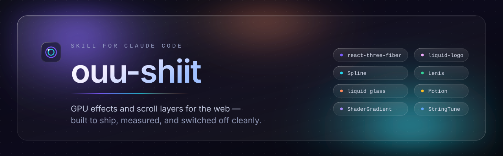

# ouu-shiit

**A Claude Code skill for adding real-time GPU effects, scroll-driven motion, and video to a creative surface without wrecking it — a website, a 3D scene, a video, a deck.**

[](LICENSE)
[](https://skills.sh)
[](install.sh)
[](https://github.com/pbakaus/impeccable)
[](https://hyperframes.video)

Most design skills tell an agent what a page should look like. This one answers the question that comes next: **given a direction already chosen, which effect, scroll layer, or rendered frame earns a place on this surface, and how is it built so it stays fast, accessible, and alive after the hero scrolls away — or renders identically on every pass?**

It is deliberately narrow. It does not pick the design — [impeccable](https://github.com/pbakaus/impeccable) does. It supplies the effect technology, one reference per technology, and the contract every one of them has to satisfy.

It covers two mediums deeply and routes to the right reference for the rest. Web effects and video each have their own references and their own contract — and they are genuinely different contracts, so the skill keeps them apart rather than pretending one set of rules covers both.

---

## Install

Built on the [skills](https://skills.sh) CLI from [vercel-labs/skills](https://github.com/vercel-labs/skills). Node 18+ required.

```bash
npx skills add asterxsk/ouu-shiit --skill ouu-shiit -g -y
```

That installs this skill alone. But this skill is only half of the job on its own — it supplies the effect layer while the direction, the taste budget, and the audit come from elsewhere. The installer below brings the whole set.

### The whole bundle

```bash
curl -fsSL https://raw.githubusercontent.com/asterxsk/ouu-shiit/main/install.sh | sh
```

Or clone and run it locally, which lets you configure the target agent and scope:

```bash
git clone --depth 1 https://github.com/asterxsk/ouu-shiit && cd ouu-shiit && ./install.sh
```

On Windows, `install.ps1` does the same from PowerShell:

```powershell
./install.ps1
```

Or without cloning:

```powershell
irm https://raw.githubusercontent.com/asterxsk/ouu-shiit/main/install.ps1 | iex
```

Everywhere else on Windows: from Git Bash the shell script works as-is, and from `cmd.exe` use `install.cmd`.

### What the installer adds

| Skill | Role | Source |
|---|---|---|
| **ouu-shiit** | The effect layer. Eight web GPU and scroll technologies, a video framework, and a medium router. | `asterxsk/ouu-shiit` |
| **impeccable** | Owns visual direction, craft, and analysis. The skill this one defers to. | `pbakaus/impeccable` |
| **design-taste-frontend** | Brief inference, three design dials, anti-slop bans, a pre-flight check. | `Leonxlnx/taste-skill` |
| **web-design-guidelines** | The audit pass. Fetches the current Web Interface Guidelines and reviews against them. | `vercel-labs/agent-skills` |
| **HyperFrames** | Video, motion graphics, and decks — HTML to deterministic MP4. Added as the `/hyperframes` router. | `heygen-com/hyperframes` |

Installer options, by environment variable:

| Variable | Default | Effect |
|---|---|---|
| `AGENT` | `claude-code` | Which agent to install for. `'*'` for every agent detected. |
| `SCOPE` | `-g` | `-g` installs to the user directory. Empty installs into the current project. |
| `SKILL` | `1` | Set to `0` to install ouu-shiit without the companion design skills. |
| `VIDEO` | `1` | Set to `0` to skip HyperFrames, the video and deck toolchain. Worth turning off if you only want web effects. |

```bash
AGENT='*' ./install.sh          # every agent on this machine
SCOPE= ./install.sh             # this project only
SKILL=0 ./install.sh            # ouu-shiit alone
```

`install.ps1` takes the same four as parameters — `-Agent`, `-Scope`, `-Skill`, `-Video` — and falls back to the environment variables of the same name. It splits `SCOPE` into two values rather than one: `-g` (the default) for the user directory, `project` for the current project — `-Scope project`. PowerShell cannot hold an empty environment variable, so an empty `SCOPE` has no equivalent there.

```powershell
./install.ps1 -Agent '*'        # every agent on this machine
./install.ps1 -Scope project    # this project only
./install.ps1 -Skill 0          # ouu-shiit alone
```

### Manual install

Every piece is an independent install. Do them in any order:

```bash
npx skills add asterxsk/ouu-shiit               --skill ouu-shiit              -g -y
npx skills add pbakaus/impeccable               --skill impeccable             -g -y
npx skills add Leonxlnx/taste-skill             --skill design-taste-frontend  -g -y
npx skills add vercel-labs/agent-skills         --skill web-design-guidelines  -g -y
```

Or clone this repository straight into your skills directory. A skill is just a folder with a `SKILL.md` in it:

```bash
git clone --depth 1 https://github.com/asterxsk/ouu-shiit ~/.claude/skills/ouu-shiit
```

Restart your agent afterwards so it picks up the new skills.

---

## Which medium

Read [mediums.md](skills/ouu-shiit/reference/mediums.md) first. It is the router: what is being made decides which references are relevant and which contract applies. It also carries the stand-down rule — this skill is an effect and motion layer, and on a native-mobile UI or a deck's argument it hands off rather than improvising.

| The brief is… | Load |
|---|---|
| A website or web UI | [usage-map.md](skills/ouu-shiit/reference/usage-map.md), then the effect's own reference |
| A video, motion graphic, or slide deck | [hyperframes.md](skills/ouu-shiit/reference/hyperframes.md) — decks included, via its `/slideshow` workflow |
| 3D, authored in code | [react-three-fiber.md](skills/ouu-shiit/reference/react-three-fiber.md) |
| 3D, authored by a designer | [spline.md](skills/ouu-shiit/reference/spline.md) |
| An Android or iOS app screen | Nothing here is the authority — hand off to `android-native-dev`, `mobile-android-design`, or `impeccable` |

The reason this is a table and not a paragraph: the obligations genuinely change between mediums. A page lives indefinitely and costs per-frame GPU work while a visitor watches; a video is a fixed grid of frames rendered once, and its costs are render minutes and a published artifact's asset licences. **A technology moving between mediums does not carry its contract with it** — ShaderGradient on a page must pause off-screen and honour `prefers-reduced-motion`, while the same shader in a composition must be seekable and render identically on every pass.

## What's inside

Nine technologies, each with its own reference file covering how to use it, where to use it, its performance and accessibility obligations, and the pitfalls that bite in practice. Eight are the web effect layer; the ninth leaves the browser entirely.

| Technology | Delivers | Reference |
|---|---|---|
| **react-three-fiber** | Code-controlled 3D: product viewers, scenes, scroll-driven 3D, particles, post-processing | [reference](skills/ouu-shiit/reference/react-three-fiber.md) |
| **Spline** | Designer-authored 3D scenes the page can drive | [reference](skills/ouu-shiit/reference/spline.md) |
| **Liquid glass** | Glass refraction over live background — floating chrome, nav bars, panels | [reference](skills/ouu-shiit/reference/liquid-glass.md) |
| **ShaderGradient** | Animated WebGL gradient backgrounds | [reference](skills/ouu-shiit/reference/shader-gradient.md) |
| **liquid-logo** | GLSL displacement on a logo texture — liquid-metal brand moments | [reference](skills/ouu-shiit/reference/liquid-logo.md) |
| **Lenis** | Interpolated native smooth scroll | [reference](skills/ouu-shiit/reference/lenis.md) |
| **Motion** | Scroll-linked reveals, parallax, layout and exit animation. Reads scroll without owning it, so it composes with Lenis | [reference](skills/ouu-shiit/reference/motion.md) |
| **StringTune** | CSS-variable scroll and cursor choreography | [reference](skills/ouu-shiit/reference/stringtune.md) |
| **HyperFrames** | **HTML/CSS/JS → deterministic MP4.** Video, motion graphics, and slide decks | [reference](skills/ouu-shiit/reference/hyperframes.md) |

Picking between the web eight — which effect belongs on which surface, and where every one of them is the wrong answer — is [usage-map.md](skills/ouu-shiit/reference/usage-map.md). Those names are **GitHub repos, not npm package names**, and more than one unrelated project shares several of them, so the reference files open with the real repos and which one to pick. HyperFrames is the worst offender: singular `hyperframe` on PyPI is a widely-used Python HTTP/2 library, and a steel-framing company and a closed SaaS also answer to the name.

It also documents the three design references it is built to work with: [design-references.md](skills/ouu-shiit/reference/design-references.md).

## Settle the section before the effect

A hero, navbar, CTA, footer, or pricing page has a shape that exists independently of any effect you put in it. Five galleries collect real examples of exactly those sections — screenshots of shipped sites, no code, so they inform the container rather than the effect.

| Gallery | Collects | Ships code |
|---|---|---|
| [Supahero](https://supahero.io) | Hero sections — the first screen | No |
| [PricingPages.design](https://pricingpages.design) | Pricing pages | No |
| [Navbar Gallery](https://www.navbar.gallery) | Navigation bars | No |
| [CTA.gallery](https://www.cta.gallery) | Individual call-to-actions | No |
| [Footer](https://www.footer.design) | Whole website footers | No |

All five are free to browse and none of them publishes source, components, or a registry — that distinction matters, because these galleries are reference material while [ui-registries.md](skills/ouu-shiit/reference/ui-registries.md) is the installable half. Details, including which entries are sponsored placement and what the licensing actually allows, in [design-galleries.md](skills/ouu-shiit/reference/design-galleries.md).

## Before you build it, check if it exists

Several of these effects ship as free, copy-paste React components in public shadcn registries, with the ordinary UI around them included. The skill checks there first when a project is already React with shadcn configured — a maintained component beats a hand-rolled scene.

| Registry | What it gives you | Cost |
|---|---|---|
| [Cult UI](https://www.cult-ui.com) | The closest overlap with this skill: distorted glass, liquid metal, shader lens blur, animated gradient and texture backgrounds | MIT. Pro blocks are paid and excluded. |
| [Kokonut UI](https://kokonutui.com) | Small animated details rather than whole compositions: `particle-button`, `shimmer-text`, `liquid-glass-card`, `ai-prompt`. Built on Motion, with a machine-readable registry | Free and open source. Kokonut UI Pro is paid and excluded. |
| [Skiper UI](https://skiper-ui.com) | Unusual interaction moments: dynamic island, token swaps, View-Transition theme toggles, scroll marquees | Free tier plus a paid Pro tier. **The free tier requires attribution**, and Pro is excluded. |
| [Watermelon UI](https://ui.watermelon.sh) | Breadth: 260+ components, blocks, dashboards and templates to surround the one effect. Hosted MCP server, no API key. | MIT, free |

The paid tiers of all four are deliberately out of scope — the reference is written so an agent never configures a licence key or trips a paywall, and it flags the Skiper attribution requirement instead of quietly absorbing it. Details in [ui-registries.md](skills/ouu-shiit/reference/ui-registries.md).

Two of the four build on Motion, one on the older `framer-motion` package, which is the same project under its previous name. Installing both ships the animation engine twice, so the reference tells the agent to match whatever the project already has.

A registry component is not exempt from the contract. These libraries rarely honour `prefers-reduced-motion` on their own, several allocate a WebGL context, and several bind scroll listeners that will fight a smooth-scroll library — so the same six rules below apply to code you installed rather than wrote.

## How it works

The medium comes first: the skill identifies what is being made, and hands off if that is outside an effect layer's remit. Then direction — impeccable's mode and visual world, or the taste skill's motion budget for a greenfield marketing page. Then it names the effect's job in one sentence, loads the reference for that technology, and builds against that medium's contract.

### The web contract

Every browser effect in this skill obeys these six rules. **These are web rules and they are not universal** — the video reference carries a different contract, and mixing the two is a real failure mode, not a stylistic one.

- **The page works without it.** Content, copy, controls, and navigation function with the canvas absent. The effect layers over a complete page — it is never the container content lives inside.
- **GPU cost is bounded and measured.** Device pixel ratio capped, rendering paused off-screen and on a hidden tab, canvas lazy-mounted near the viewport, quality cut below ~50fps on a mid-range phone.
- **Motion respects `prefers-reduced-motion`.** Reduced motion means a static, composed frame — not a paused canvas showing nothing.
- **Everything is unmounted and disposed.** A leaked renderer exhausts the browser's WebGL context limit and kills every canvas on the page.
- **It is legible and keyboard-reachable.** Text over an effect gets a real contrast guarantee, not hope.
- **Scroll has exactly one owner.** Native, Lenis, drei `ScrollControls`, or StringTune — one of them, never two.

### The video contract

Different medium, different obligations. A video is a fixed set of frames rendered once, so what matters is determinism (same input, same frames — which holds only if animations are *seekable* rather than wall-clock), render time instead of per-frame GPU cost, codec and delivery format chosen at encode, mixed audio levels in LUFS, captions as an accessibility requirement, and cleared licences on every asset, since the output is a published artifact. Full detail in [hyperframes.md](skills/ouu-shiit/reference/hyperframes.md).

The skill also reconciles against impeccable's craft floor rather than working around it: glass has to earn its place by showing something the user benefits from seeing, gradient text stays refused, and effects never mask weak fundamentals.

## Repository layout

```
skills/ouu-shiit/
├── SKILL.md                the skill: inventory, router, order of operations, the contracts
└── reference/
    ├── mediums.md          the router — which medium takes which reference
    ├── usage-map.md        where each web effect belongs, and where it does not
    ├── design-references.md  impeccable, the taste skill, the DESIGN.md catalog
    ├── design-galleries.md  hero, pricing, navbar, CTA, and footer galleries
    ├── ui-registries.md    Cult UI, Kokonut UI, Skiper UI, Watermelon UI — the free tiers
    ├── hyperframes.md      video, motion graphics, and decks — and the video contract
    ├── react-three-fiber.md
    ├── spline.md
    ├── liquid-glass.md
    ├── shader-gradient.md
    ├── liquid-logo.md
    ├── lenis.md
    ├── motion.md
    └── stringtune.md
assets/                     banner and mark
install.sh                  installer, built on the skills CLI
install.ps1 install.cmd     the same, for PowerShell and cmd.exe
```

## Optional: the DESIGN.md catalog

[awesome-design-md](https://github.com/VoltAgent/awesome-design-md) is 74 design systems analysed from real sites, one `DESIGN.md` per brand. It is reference material, not a skill, so it is not installable — clone it and copy a single file into a project root when a brief names a reference point:

```bash
git clone --depth 1 https://github.com/VoltAgent/awesome-design-md
```

Read it for structure and calibration, then derive the actual palette and type from the user's own brand. It describes other companies' identities, not an identity to ship.

## Credits

Builds on the work of [`pmndrs/react-three-fiber`](https://github.com/pmndrs/react-three-fiber), [Spline](https://spline.design), [`motion`](https://motion.dev), [`heygen-com/hyperframes`](https://github.com/heygen-com/hyperframes), [`pbakaus/impeccable`](https://github.com/pbakaus/impeccable), [`Leonxlnx/taste-skill`](https://github.com/Leonxlnx/taste-skill), [`vercel-labs/agent-skills`](https://github.com/vercel-labs/agent-skills), [`nolly-studio/cult-ui`](https://github.com/nolly-studio/cult-ui), [Kokonut UI](https://kokonutui.com), [Skiper UI](https://skiper-ui.com), [`WatermelonCorp`](https://github.com/WatermelonCorp), and the [skills](https://github.com/vercel-labs/skills) CLI. Each linked technology and component library belongs to its own authors; this repository only documents how to use them well, and documents their free tiers only.

HyperFrames is Apache-2.0 and rendered locally by default, at no per-render cost. Only its `cloud render` path bills, and its 21 published skills are its own to maintain — [hyperframes.md](skills/ouu-shiit/reference/hyperframes.md) deliberately routes to them rather than restating them.

## License

[MIT](LICENSE)
